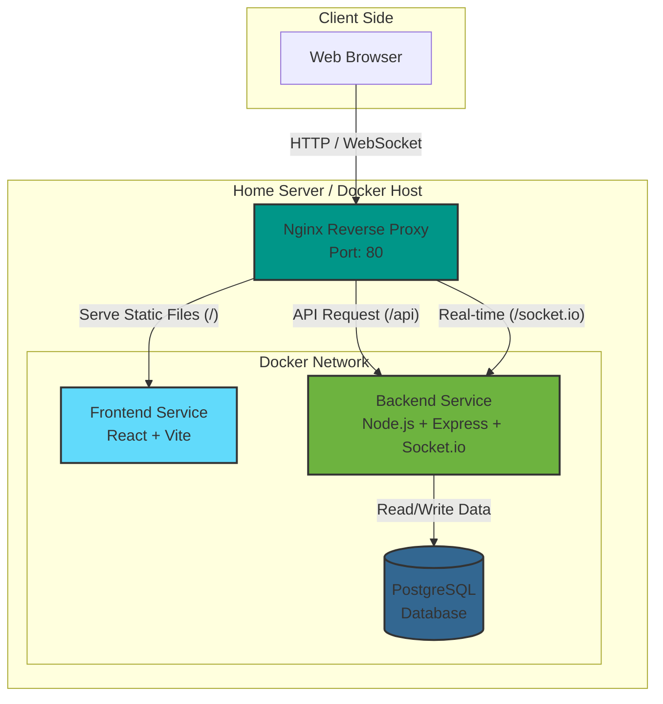

```mermaid
graph TD
    subgraph User_Environment [Client Side]
        Browser[Web Browser]
    end

    subgraph Docker_Host [Home Server / Docker Host]
        Nginx[Nginx Reverse Proxy<br/>Port: 80]
        
        subgraph Docker_Network [Docker Network]
            Frontend[Frontend Service<br/>React + Vite]
            Backend[Backend Service<br/>Node.js + Express + Socket.io]
            DB[(PostgreSQL<br/>Database)]
        end
    end

    %% Connections
    Browser -- "HTTP / WebSocket" --> Nginx
    Nginx -- "Serve Static Files (/)" --> Frontend
    Nginx -- "API Request (/api)" --> Backend
    Nginx -- "Real-time (/socket.io)" --> Backend
    Backend -- "Read/Write Data" --> DB

    %% Styling
    style Nginx fill:#009688,stroke:#333,stroke-width:2px
    style Backend fill:#6db33f,stroke:#333,stroke-width:2px
    style Frontend fill:#61dafb,stroke:#333,stroke-width:2px
    style DB fill:#336791,stroke:#333,stroke-width:2px
```
