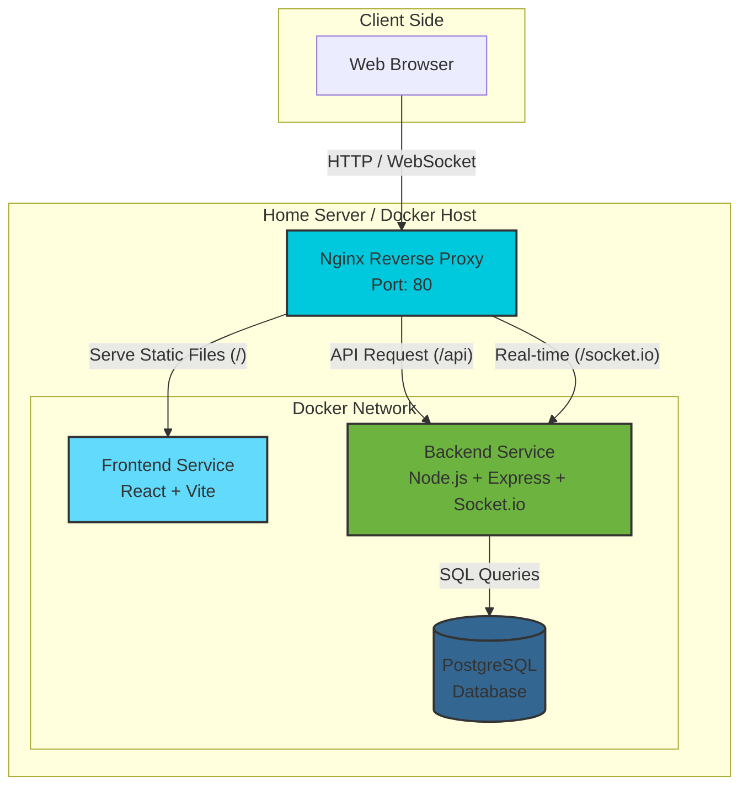

[백엔드 링크](https://github.com/bs6465/SWEtim)

# TIM8 - 실시간 원격 협업 대시보드 (Real-time Collaboration Dashboard)


> **"팀 프로젝트를 위한 올인원 솔루션: 일정 관리, 실시간 채팅, 그리고 팀원 현황을 한눈에."**
>
> 개발(Full Stack & DevOps)로 설계부터 배포 환경 구성까지 전 과정을 주도하여 개발했습니다.

## 🏗️ 아키텍처 (Architecture)

Nginx를 리버스 프록시로 활용하여 프론트엔드와 백엔드, Socket.io 통신을 단일 진입점(Port 80)으로 통합 관리하는 **Docker Compose 기반의 컨테이너 환경**을 구축했습니다.



## 🛠️ 기술 스택 (Tech Stack)

### Frontend

- **Core:** React (Vite), JavaScript (ES6+)
- **Styling:** Tailwind CSS
- **State Management:** React Hooks (useState, useEffect, useMemo), Context API patterns
- **Real-time:** Socket.io-client

### Backend

- **Server:** Express
- **Database:** PostgreSQL:18 (pg library)
- **Auth:** JWT (JSON Web Token), bcrypt
- **Real-time:** Socket.io

### DevOps & Infrastructure

- **Containerization:** Docker, Docker Compose
- **Proxy Server:** Nginx (Reverse Proxy configuration)
- **Deployment:** Home Server (Linux environment)

## ✨ 주요 기능 (Key Features)

### 1\. 🔐 인증 및 온보딩

- **JWT 기반 인증 시스템:** Access Token을 활용한 보안 통신.
- **초대 링크 시스템:** `http://domain/invite/:teamId` 링크를 통한 원클릭 팀 합류.
- **스마트 타임존 감지:** 회원가입 시 브라우저 API(`Intl`)를 이용해 사용자의 현지 시간대 자동 설정.

### 2\. 📅 스마트 캘린더 (Custom Calendar)

- **Tetris Layout 알고리즘:** 겹치는 일정을 시각적으로 겹치지 않게 자동 정렬하여 배치.
- **Continuous Bar UI:** 끊김 없는 연속적인 일정 바(Bar) 구현.
- **진행률 시각화:** 일정 내 체크리스트 완료율에 따라 바의 색상이 차오르는 동적 UI.
- **글로벌 타임존 지원:** DB에는 UTC(`timestamptz`)로 저장하고, 프론트에서는 각 팀원의 현지 시간으로 자동 변환 표시.

### 3\. 👥 팀 관리 & 실시간 협업

- **실시간 상태 동기화:** Socket.io를 이용해 팀원의 접속 상태(Online/Offline)를 실시간 감지.
- **관리자 권한:** 팀장(Owner)에게만 팀원 강퇴 및 팀 삭제, 권한 위임(왕위 계승) 기능 제공.
- **실시간 채팅:** 팀원 간 즉각적인 소통 지원.

## 🚀 설치 및 실행 (Getting Started)

### Prerequisites

- Docker & Docker Compose installed

### Installation

1.  docker-compose.yml을 다운합니다
2.  환경 변수(.env)를 작성합니다. (.env 예시)
    ```env
    POSTGRES_USER=postgres
    POSTGRES_PASSWORD=password
    POSTGRES_DB=db
    JWT_SECRET=your_secret_key
    ```
3.  Docker Compose로 서비스를 실행합니다.
    ```bash
    docker-compose up -d
    ```
4.  브라우저에서 접속합니다.
    - `http://localhost`
